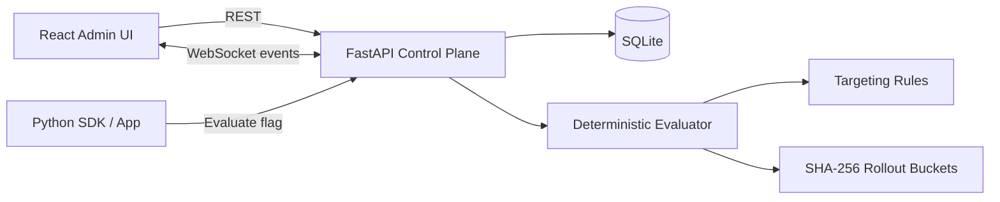

# FlagForge

**A self-hosted feature-flag and progressive-delivery control plane.** FlagForge lets engineering teams create feature flags, target cohorts, perform deterministic percentage rollouts, evaluate flags from applications, and audit configuration changes from a live dashboard.

> Built as a production-minded systems project: deterministic evaluation, persistent state, realtime updates, an SDK, tests, containers, and CI — not just a CRUD demo.

## Highlights

- **Deterministic percentage rollouts** using SHA-256 bucketing so the same user receives a stable decision
- **Attribute targeting** with `equals`, `in`, and `starts_with` operators
- **Environment-aware flags** for development, staging, and production
- **Realtime control-plane updates** over WebSockets
- **Persistent SQLite storage** with an append-only audit trail
- **Evaluation metrics** for flag decision volume and enabled-rate tracking
- **Zero-dependency Python SDK** for consuming flags from another service
- **React + TypeScript admin dashboard** with live toggles and rollout controls
- **Docker Compose** local environment
- **Automated tests and GitHub Actions CI**

## Architecture



## Evaluation algorithm

For each request, FlagForge:

1. Returns `false` immediately if the flag is disabled.
2. Checks enabled targeting rules against request attributes.
3. Hashes `flag_key:user_id` with SHA-256 to assign the user a stable bucket from `0.00` to `99.99`.
4. Enables the feature when that bucket falls inside the configured rollout percentage.

This avoids random decisions on every request and produces stable cohort membership without storing a row for every user.

## Run locally

```bash
docker compose up --build
```

Then open:

- Dashboard: `http://localhost:5173`
- API docs: `http://localhost:8000/docs`
- Health check: `http://localhost:8000/health`

### Backend only

```bash
cd backend
python -m venv .venv
source .venv/bin/activate
pip install -r requirements.txt
uvicorn app.main:app --reload
```

### Frontend only

```bash
cd frontend
npm install
npm run dev
```

## API example

```bash
curl -X POST http://localhost:8000/api/evaluate \
  -H 'Content-Type: application/json' \
  -d '{"flag_key":"smart-checkout","user_id":"user-1024","attributes":{"plan":"pro","country":"CA"}}'
```

## Python SDK

```python
from flagforge import FlagForgeClient

flags = FlagForgeClient("http://localhost:8000")
if flags.enabled("smart-checkout", "user-1024", plan="pro", country="CA"):
    show_new_checkout()
```

## Tests

```bash
cd backend
pytest -q
```

The test suite covers stable hashing, targeting semantics, disabled flags, persistence, updates, and audit logging.

## Engineering trade-offs

This version intentionally uses SQLite so a reviewer can run the full project with almost no setup. In a multi-instance deployment, the persistence layer can move to PostgreSQL and WebSocket fan-out can move to Redis Pub/Sub without changing the evaluation contract.

A production system at very high request volume would additionally distribute versioned flag snapshots to edge or in-process SDKs, reducing latency and removing a network hop from each flag check.

## Next extensions

- Multi-tenant organizations and RBAC
- PostgreSQL + Redis Pub/Sub deployment mode
- Flag prerequisites and multivariate experiments
- Event ingestion for experiment conversion metrics
- Versioned configuration snapshots and rollback
- TypeScript SDK and streaming SDK updates
- OpenTelemetry traces and Prometheus metrics

## Resume-ready summary

**FlagForge — Feature Flag & Experimentation Platform**  
Built a full-stack progressive-delivery platform with FastAPI, React, TypeScript, WebSockets, and SQLite; implemented deterministic SHA-256 user bucketing, attribute-based targeting, percentage rollouts, audit logging, an application SDK, Dockerized local deployment, automated tests, and CI.

---

Built by **Abia Ali**.
